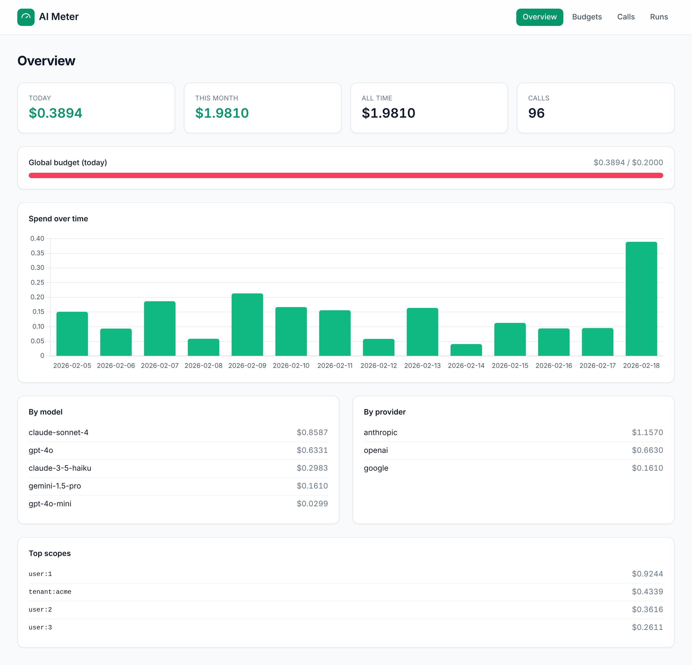
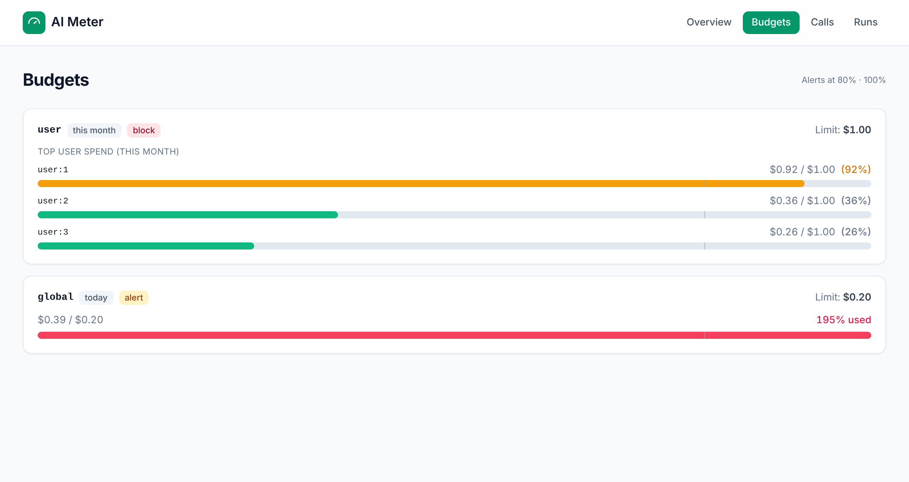
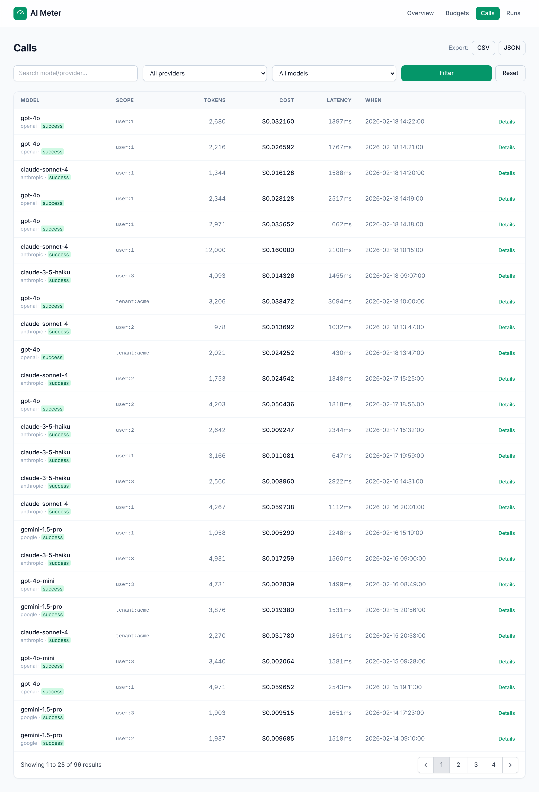
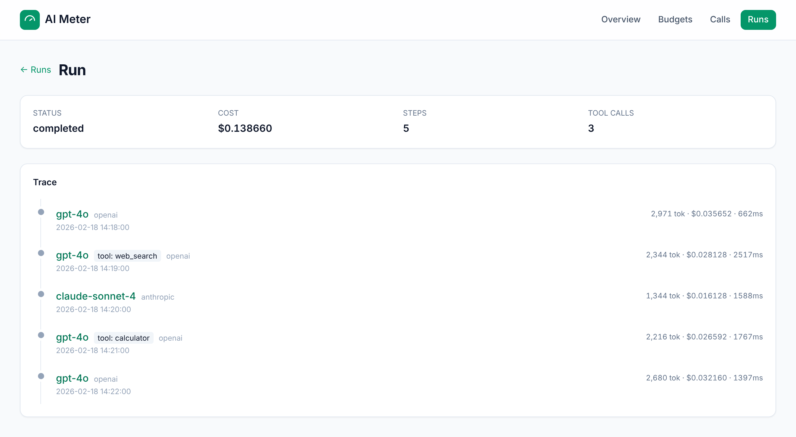

# Laravel AI Meter

**Self-hosted metering *and* budget enforcement for AI/LLM & agent calls in Laravel.** Trace every call, attribute token cost to a user/tenant, see it in a built-in dashboard, and **block runaway spend before it happens** — all in your own app, with **no external service**.

> Think *Telescope + a spend governor* for your AI calls.

[](https://github.com/nowshad7/laravel-ai-meter/actions/workflows/tests.yml)
[](LICENSE)

---

## Why this exists

Shipping AI features is easy; **controlling their cost is not.** Existing tools make you choose:

| | Send data to an external service? | Built-in dashboard? | Enforce budgets? | Scope |
|---|:--:|:--:|:--:|---|
| Langfuse-style tracing | **Yes** (run a second service) | Its own | ❌ observe only | — |
| Budget packages | No | ❌ (raw table) | ⚠️ per-run only | per run |
| **Laravel AI Meter** | **No** | ✅ | ✅ **block/alert** | **user / tenant / day / month / total** |

AI Meter is the only option that **meters and enforces, self-hosted, with a dashboard**, and attributes spend to whoever caused it.

## Features

- 📊 **Dashboard** (Blade + Tailwind, dark mode): spend today / this month / all-time, spend-over-time chart, cost by model & provider, top scopes, a **budgets page** (every budget's live used-fraction with 80% / 100% markers), and a filterable call log with per-call detail.
- 🧾 **Cost attribution** — every call priced from a bundled, overridable price book (unknown models use a configurable fallback, never silently $0), refreshable with `ai-meter:update-prices`.
- 🛑 **Budget enforcement** — spend ceilings per **user / tenant / global**, over **run / day / month / total**, with `block` (HTTP 402) or `alert` actions.
- 🔔 **Budget alerts** — mail / Slack notifications the moment a scope crosses **80% / 100%** of a budget (configurable thresholds), once per window, or listen for the event yourself.
- 🔌 **Capture anything** — a reliable `Meter::log()` / `Meter::recordPrism()` API, plus opt-in auto-instrumentation for the Laravel AI SDK, Neuron AI, and Prism (`Meter::prismTap()`).
- 🔐 **Safe by default** — prompt/response storage is optional, redacted (keys, tokens, emails, card-like numbers) and truncated; dashboard behind an auth gate; `noindex`.
- 🗄️ **Self-hosted** — stores in your database, works on MySQL, PostgreSQL, SQLite and SQL Server. No accounts, no egress.
- ⚡ **Scales to every request** — enforce budgets off per-request Redis counters (`CacheSpendStore`) instead of SUM-ing the calls table.

## Screenshots

The self-hosted dashboard (Blade + Tailwind, light & dark):

**Overview** — spend today / this month / all-time, spend-over-time, and cost by model, provider & scope:



**Budgets** — every configured budget's live used-fraction, with the alert thresholds marked and over-limit scopes in red:



**Calls** — a filterable call log with CSV / JSON export and per-call detail:



**Run trace** — group an agent's calls under a run and see the whole trace, step by step:



## Requirements

- PHP `^8.1`
- Laravel `^10 | ^11 | ^12`

## Installation

```bash
composer require nsd7/laravel-ai-meter
php artisan migrate
```

Visit **`/ai-meter`** while logged in. Publish the config to customise:

```bash
php artisan vendor:publish --tag=ai-meter-config
```

## Usage

### Record a call

The reliable, version-proof way to meter any provider/SDK:

```php
use Nsd7\AiMeter\Facades\Meter;
use Nsd7\AiMeter\Core\Budget\BudgetScope;

Meter::log([
    'provider' => 'openai',
    'model'    => 'gpt-4o',
    'usage'    => ['prompt_tokens' => 1200, 'completion_tokens' => 350],
    'scope'    => BudgetScope::user(auth()->id()),
    'latency_ms' => 820,
    'input'    => $prompt,     // optional, redacted + truncated
    'output'   => $answer,     // optional
]);
```

### Record a Prism response

```php
$response = Prism::text()->using('openai', 'gpt-4o')->withPrompt($prompt)->asText();

Meter::recordPrism($response, [
    'provider' => 'openai',
    'scope'    => BudgetScope::user(auth()->id()),
]);
```

Token usage and model are read straight off the Prism response, so cost is computed for you.

### Auto-instrumentation

**Laravel AI SDK** — meter every call automatically, no manual `record()`. Enable the adapter; the package listens to the SDK's end-of-prompt event:

```php
// config/ai-meter.php
'adapters' => [
    'laravel_ai' => [
        'enabled' => true,
        // Match your installed version (see `php artisan event:list`):
        'event'   => 'Laravel\\Ai\\Events\\AgentPrompted',
        'scope'   => fn () => BudgetScope::user(auth()->id()), // optional; defaults to the auth user
    ],
],
```

It reads usage/model defensively (works across SDK versions) and only wires up when enabled and the event class exists — so it never affects an app that doesn't use it.

**Neuron AI** — same idea: enable the adapter and it records each inference by listening to the event Neuron dispatches when a call completes.

```php
// config/ai-meter.php
'adapters' => [
    'neuron' => [
        'enabled' => true,
        // Match your installed version:
        'event'   => 'NeuronAI\\Observability\\Events\\InferenceStop',
        'scope'   => fn () => BudgetScope::user(auth()->id()), // optional; defaults to the auth user
    ],
],
```

Usage/model are read off the event's message/response defensively (including
`getUsage()` / `getModel()` accessors), so it keeps working across Neuron
versions and stays dormant until enabled.

**Prism** has no global event hook, so use the ready-made callback with Prism's `->asText()`:

```php
Prism::text()->using('openai', 'gpt-4o')->withPrompt($prompt)
    ->asText(Meter::prismTap(['provider' => 'openai', 'scope' => BudgetScope::user(auth()->id())]));
```

### Enforce a budget

Config:

```php
'budgets' => [
    ['scope' => 'user',   'period' => 'month', 'limit' => 50,  'action' => 'block'],
    ['scope' => 'global', 'period' => 'day',   'limit' => 500, 'action' => 'alert'],
],
```

Guard a route — returns **HTTP 402** when the user is over their monthly ceiling:

```php
Route::post('/chat', ChatController::class)->middleware('ai.budget:user');
```

Or check in code (great for pausing an agent mid-run):

```php
$decision = Meter::check(BudgetScope::user($id));
if (! $decision->allowed) {
    // over a blocking budget — stop before the next expensive step
}

$left = Meter::remaining(BudgetScope::user($id)); // USD remaining, or null
```

### Budget alerts (80% / 100%)

Both `block` **and** `alert` budgets fire a notification the first time a scope's
spend crosses a threshold within the budget's window — so you hear about a
runaway spend as it happens, not after the bill. Point it at an email address
and/or a Slack incoming-webhook:

```php
// config/ai-meter.php
'alerts' => [
    'enabled'    => true,
    'thresholds' => [0.8, 1.0],   // alert at 80% and 100% of the limit
    'notify' => [
        'mail'  => env('AI_METER_ALERT_MAIL'),           // address or array of addresses
        'slack' => env('AI_METER_ALERT_SLACK_WEBHOOK'),  // Slack incoming-webhook URL
    ],
],
```

Each threshold alerts **once per window** (a `day` budget re-arms tomorrow, a
`month` budget next month), and a single jump past several thresholds sends only
the highest. Prefer your own handling? Leave `notify` empty and listen for the
event:

```php
use Nsd7\AiMeter\Events\BudgetThresholdReached;

Event::listen(function (BudgetThresholdReached $e) {
    // $e->scope, $e->budget, $e->threshold (0.8), $e->spentUsd, $e->exceeded()
});
```

### Agent runs (trace + runaway-loop guard)

Wrap an agent loop in a run to group its calls, see the whole trace in the
dashboard, and **stop a runaway loop** before it drains the budget:

```php
use Nsd7\AiMeter\Facades\Meter;
use Nsd7\AiMeter\Core\Budget\BudgetScope;

$run = Meter::run(BudgetScope::user(auth()->id()), [
    'label'          => 'support-agent',
    'budget'         => 2.00,   // USD for this whole run
    'max_tool_calls' => 10,     // runaway-loop cap
    'max_wall_clock' => 120,    // seconds
]);

try {
    while ($agent->thinking()) {
        $run->guard();                 // throws before the next step if over a cap/budget
        $response = $agent->step();
        $run->recordPrism($response);  // or $run->record([...]) for tool calls
    }
    $run->finish();
} catch (\Nsd7\AiMeter\Runs\Exceptions\RunLimitExceededException
       | \Nsd7\AiMeter\Budget\Exceptions\BudgetExceededException $e) {
    $run->fail($e->getMessage());      // loop stopped safely
}
```

Every run shows up under the **Runs** tab with its step/tool-call count, cost
vs. budget, and a per-call trace.

### Agent-facing budget API

Enable `features.api` to expose a read-only **"how much budget is left?"**
endpoint — ideal for an SPA, a dashboard, or an **AI agent** deciding whether it
can afford another step:

```
GET {prefix}/api/budget                      # the authenticated user's scope
GET {prefix}/api/budget?scope_type=global
GET {prefix}/api/budget?scope_type=tenant&scope_id=42
```

```json
{
  "scope": { "type": "user", "id": 7 },
  "allowed": true,
  "spend": { "day": 1.2, "month": 10.5, "total": 42.0 },
  "currency": "USD",
  "budgets": [
    { "period": "month", "action": "block", "limit_usd": 50,
      "spent_usd": 10.5, "remaining_usd": 39.5, "used_fraction": 0.21,
      "exceeded": false, "allowed": true }
  ]
}
```

It runs behind the same middleware and gate as the dashboard. The same data is
available in code via `Meter::budgetReport($scope)` — hand it to an MCP tool to
let an agent check its own budget.

## Configuration

Key options in `config/ai-meter.php`:

| Key | Default | Description |
|---|---|---|
| `route.prefix` / `route.middleware` | `ai-meter` / `['web','auth']` | Dashboard routing. |
| `gate` | `viewAiMeter` | Gate checked when defined. |
| `recording.store_io` | `true` | Persist (redacted) prompt/response text. |
| `recording.redact` / `max_io_chars` | `true` / `8000` | Scrub secrets; truncate. |
| `pricing.currency` / `fx_rate` | `USD` / `null` | Display currency + USD→local conversion. |
| `pricing.unknown_model` | `{input:1,output:3}` | Fallback price per 1M tokens. |
| `pricing.prices` | `[]` | Override/extend the bundled price book (wins over everything). |
| `pricing.prices_path` | `null` | App-owned price-book JSON, loaded above the bundled table. |
| `pricing.update.source` | package book URL | Source for `ai-meter:update-prices`. |
| `budgets` | `[]` | Spend ceilings (scope, period, limit, action). |
| `spend_store.driver` | `database` | `database` (SUM per request) or `cache` (Redis counters). |
| `prune.keep_days` | `90` | Retention for `ai-meter:prune`. |

### High-volume budget enforcement

By default, "how much has this scope spent?" is a `SUM` of the calls table on
each check — exact and zero-setup. Apps enforcing budgets on *every* request
can switch to **cache counters** instead:

```php
// config/ai-meter.php
'spend_store' => ['driver' => 'cache'],   // or AI_METER_SPEND_STORE=cache
```

The `cache` driver (`CacheSpendStore`) increments a Redis (or any cache)
counter per scope and period window as each call is recorded, so budget reads
are O(1) GETs. Counters reflect spend recorded **after** the driver is enabled
(they aren't backfilled); day/month counters expire with their window. Keep the
`database` driver if you need exact historical aggregation.

### Commands

```bash
php artisan ai-meter:prune            # delete call records older than prune.keep_days
php artisan ai-meter:update-prices    # refresh the price book so token costs don't drift
php artisan ai-meter:export           # export the (filtered) call log as CSV or JSON
```

**Export the call log.** The dashboard's **Calls** page has CSV / JSON buttons
that export exactly what the current filters show. The same is available on the
CLI, with filters and a date window:

```bash
php artisan ai-meter:export --format=json --output=storage/app/calls.json
php artisan ai-meter:export --provider=openai --since=2024-06-01 --until=2024-06-30 --output=june.csv
php artisan ai-meter:export --with-io > calls.csv   # include prompt/response + properties
```

Without `--output` it writes to stdout. Metadata columns (tokens, cost, scope,
latency, trace/run ids, …) are always included; the prompt/response text and
`properties` are added only with `--with-io` (or `?io=1` on the dashboard link).

**Keep prices current without upgrading the package.** `ai-meter:update-prices`
fetches a price book (the package's maintained one by default, or any
`--source` URL / file in the same `provider → model → {input, output, cached_input}`
shape) and merges it into an app-owned file:

```bash
php artisan ai-meter:update-prices --dry-run           # preview: N new, M changed
php artisan ai-meter:update-prices --path=storage/app/ai-meter/prices.json
```

Point `pricing.prices_path` (or `AI_METER_PRICES_SOURCE` / `AI_METER_PRICES_PATH`)
at that file and it's loaded **above the bundled table** but **below** your
explicit `pricing.prices` overrides — so a refresh never clobbers your custom
prices. Use `--replace` to overwrite instead of merge.

## Roadmap

- **v0.2 (done)** — agent **runs** with a trace view and `Meter::run()` per-run tool-call & wall-clock caps (runaway-loop guard).
- **v0.2.x (done)** — Laravel AI SDK auto-instrumentation (event listener) + a `Meter::prismTap()` callback for Prism.
- **v0.4 (done)** — agent-facing budget API (`features.api`, `Meter::budgetReport()`) for "how much budget is left?".
- **v0.4.x (done)** — alert notifications, budgets dashboard page, `ai-meter:update-prices`, call-log export, `CacheSpendStore`, Neuron adapter.
- **v1.0** — docs site, stability.
- **Later** — a framework-agnostic core + a Symfony bundle.

## Testing

```bash
composer install
composer test
```

## License

MIT. See [LICENSE](LICENSE).
